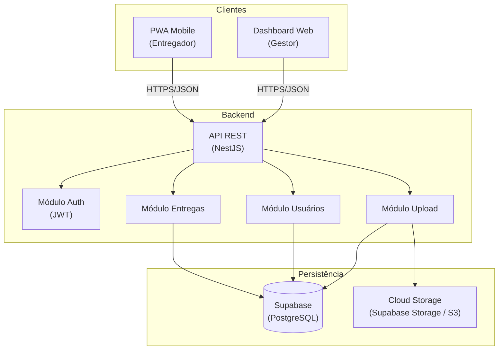
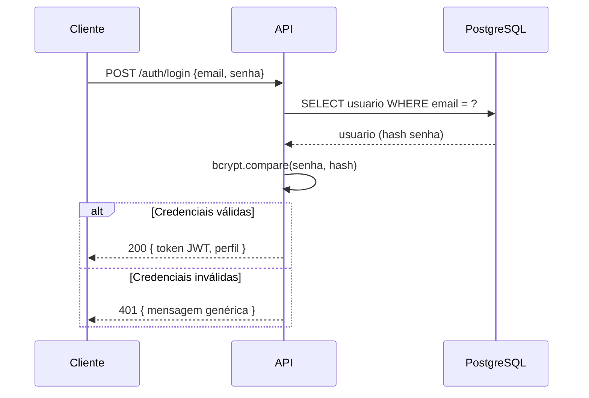
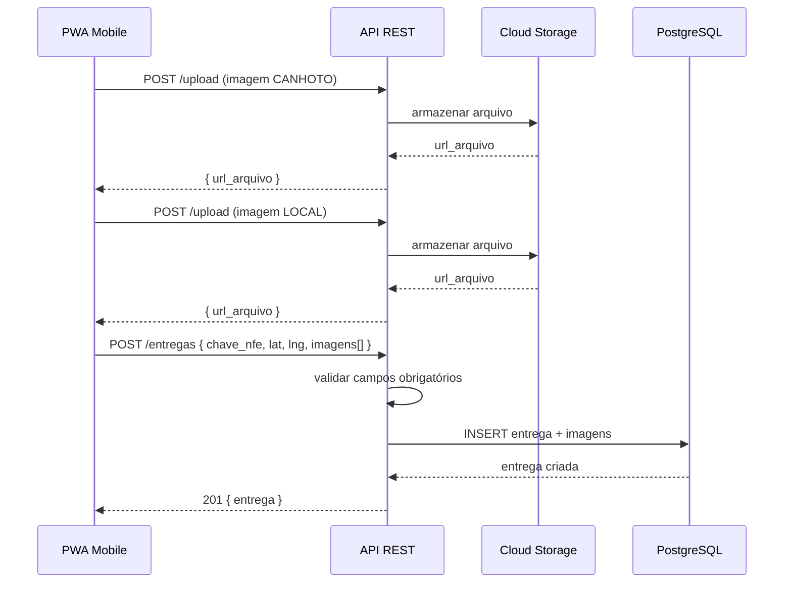
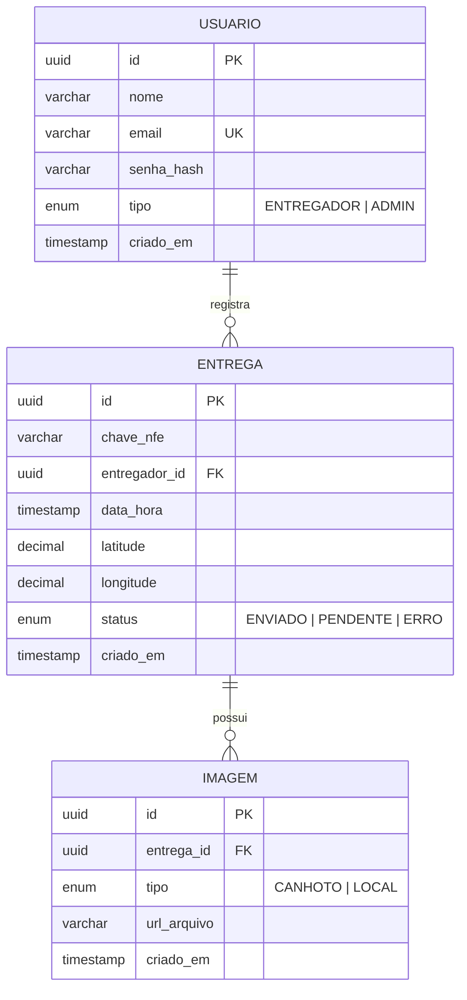

# Documento de Design

## Visão Geral

O SaaS de Comprovação Digital de Recebimento de NF-e é uma aplicação web full-stack composta por um PWA mobile-first para entregadores e um painel administrativo web para gestores. A arquitetura segue o padrão cliente-servidor com uma API REST stateless protegida por JWT.

O sistema é dividido em três camadas principais:
- **Frontend PWA** (React/Next.js): interface do entregador, otimizada para mobile
- **Frontend Admin** (React/Next.js): painel administrativo para gestores
- **Backend API** (Node.js/NestJS): lógica de negócio, autenticação, persistência
- **Infraestrutura**: Supabase (PostgreSQL gerenciado) para dados relacionais, AWS S3 (ou Supabase Storage) para imagens

---

## Arquitetura



### Fluxo de Autenticação



### Fluxo de Registro de Entrega



---

## Componentes e Interfaces

### API REST — Endpoints

| Método | Rota | Perfil | Descrição |
|--------|------|--------|-----------|
| POST | /auth/login | Público | Autenticação |
| POST | /usuarios | ADMIN | Cadastrar entregador |
| GET | /usuarios | ADMIN | Listar entregadores |
| POST | /upload | ENTREGADOR | Upload de imagem |
| POST | /entregas | ENTREGADOR | Criar entrega |
| GET | /entregas | ADMIN | Listar entregas (com filtros) |
| GET | /entregas/:id | ADMIN | Detalhe da entrega |

### Módulo Auth

```typescript
interface LoginDto {
  email: string;      // formato email válido
  senha: string;      // mínimo 8 caracteres
}

interface AuthResponse {
  token: string;      // JWT com expiração de 8h
  perfil: 'ENTREGADOR' | 'ADMIN';
  nome: string;
}

interface JwtPayload {
  sub: string;        // usuario.id
  perfil: 'ENTREGADOR' | 'ADMIN';
  iat: number;
  exp: number;
}
```

### Módulo Entregas

```typescript
interface CriarEntregaDto {
  chave_nfe: string;          // exatamente 44 dígitos numéricos
  latitude: number;
  longitude: number;
  imagens: ImagemEntregaDto[];  // mínimo 2: CANHOTO + LOCAL
}

interface ImagemEntregaDto {
  url_arquivo: string;
  tipo: 'CANHOTO' | 'LOCAL';
}

interface EntregaResponse {
  id: string;
  chave_nfe: string;
  entregador_id: string;
  entregador_nome: string;
  data_hora: string;          // ISO 8601, gerado pelo servidor
  latitude: number;
  longitude: number;
  status: 'ENVIADO' | 'PENDENTE' | 'ERRO';
  imagens: ImagemResponse[];
}

interface FiltrosEntregaQuery {
  entregador_id?: string;
  data_inicio?: string;       // ISO 8601
  data_fim?: string;          // ISO 8601
  chave_nfe?: string;         // busca parcial
  page?: number;
  limit?: number;
}
```

### Módulo Upload

```typescript
interface UploadResponse {
  url_arquivo: string;
  tipo: 'CANHOTO' | 'LOCAL';
}

// Restrições de upload
const UPLOAD_CONFIG = {
  tamanho_maximo_bytes: 10 * 1024 * 1024,  // 10 MB
  formatos_aceitos: ['image/jpeg', 'image/png'],
};
```

### Guards de Autorização

```typescript
// Guard aplicado em rotas administrativas
@Roles('ADMIN')
// Guard aplicado em rotas de entregador
@Roles('ENTREGADOR')
// Extrai perfil do JwtPayload e valida
```

---

## Modelos de Dados

### Diagrama Entidade-Relacionamento



### Schema PostgreSQL

```sql
CREATE TYPE perfil_usuario AS ENUM ('ENTREGADOR', 'ADMIN');
CREATE TYPE status_entrega AS ENUM ('ENVIADO', 'PENDENTE', 'ERRO');
CREATE TYPE tipo_imagem AS ENUM ('CANHOTO', 'LOCAL');

CREATE TABLE usuarios (
    id          UUID PRIMARY KEY DEFAULT gen_random_uuid(),
    nome        VARCHAR(255) NOT NULL,
    email       VARCHAR(255) NOT NULL UNIQUE,
    senha_hash  VARCHAR(255) NOT NULL,
    tipo        perfil_usuario NOT NULL,
    criado_em   TIMESTAMP WITH TIME ZONE DEFAULT NOW()
);

CREATE TABLE entregas (
    id              UUID PRIMARY KEY DEFAULT gen_random_uuid(),
    chave_nfe       CHAR(44) NOT NULL,
    entregador_id   UUID NOT NULL REFERENCES usuarios(id),
    data_hora       TIMESTAMP WITH TIME ZONE NOT NULL DEFAULT NOW(),
    latitude        DECIMAL(10, 6) NOT NULL,
    longitude       DECIMAL(10, 6) NOT NULL,
    status          status_entrega NOT NULL DEFAULT 'ENVIADO',
    criado_em       TIMESTAMP WITH TIME ZONE DEFAULT NOW()
);

CREATE TABLE imagens (
    id          UUID PRIMARY KEY DEFAULT gen_random_uuid(),
    entrega_id  UUID NOT NULL REFERENCES entregas(id) ON DELETE CASCADE,
    tipo        tipo_imagem NOT NULL,
    url_arquivo VARCHAR(1024) NOT NULL,
    criado_em   TIMESTAMP WITH TIME ZONE DEFAULT NOW()
);

-- Índices para performance nas queries de filtro
CREATE INDEX idx_entregas_entregador ON entregas(entregador_id);
CREATE INDEX idx_entregas_data_hora ON entregas(data_hora DESC);
CREATE INDEX idx_entregas_chave_nfe ON entregas(chave_nfe);
```

---

## Propriedades de Corretude

*Uma propriedade é uma característica ou comportamento que deve ser verdadeiro em todas as execuções válidas do sistema — essencialmente, uma declaração formal sobre o que o sistema deve fazer. Propriedades servem como ponte entre especificações legíveis por humanos e garantias de corretude verificáveis por máquina.*

### Propriedade 1: Autenticação com credenciais válidas sempre retorna JWT

*Para qualquer* par (email, senha) que corresponda a um usuário cadastrado no sistema, o endpoint POST /auth/login SHALL retornar um token JWT válido contendo o perfil correto do usuário.

**Valida: Requisitos 1.1, 1.4**

---

### Propriedade 2: Credenciais inválidas nunca retornam token

*Para qualquer* par (email, senha) onde email não existe no sistema ou a senha não corresponde ao hash armazenado, o endpoint POST /auth/login SHALL retornar status 401 sem token JWT.

**Valida: Requisitos 1.2**

---

### Propriedade 3: Entrega válida sempre é persistida com timestamp do servidor

*Para qualquer* entrega submetida com chave NF-e de 44 dígitos, 2 imagens (CANHOTO + LOCAL) e coordenadas geográficas, o campo data_hora da entrega persistida SHALL ser gerado pelo servidor e não pelo cliente.

**Valida: Requisitos 3.1, 3.5**

---

### Propriedade 4: Entrega inválida nunca é persistida

*Para qualquer* combinação de campos obrigatórios ausentes (chave_nfe, imagens, coordenadas), a tentativa de criação de entrega SHALL ser rejeitada e nenhum registro SHALL ser inserido no banco de dados.

**Valida: Requisitos 3.2, 3.3, 3.4**

---

### Propriedade 5: Validação da chave NF-e

*Para qualquer* string submetida como chave_nfe, o sistema SHALL aceitar somente strings compostas por exatamente 44 dígitos numéricos e rejeitar qualquer outra entrada.

**Valida: Requisitos 3.6, 6.4**

---

### Propriedade 6: Upload — rejeição por tamanho

*Para qualquer* arquivo com tamanho superior a 10 MB, o endpoint POST /upload SHALL rejeitar o arquivo com erro de validação, independentemente do formato.

**Valida: Requisitos 4.2**

---

### Propriedade 7: Upload — rejeição por formato

*Para qualquer* arquivo com Content-Type diferente de image/jpeg ou image/png, o endpoint POST /upload SHALL rejeitar o arquivo com erro de validação, independentemente do tamanho.

**Valida: Requisitos 4.3**

---

### Propriedade 8: Controle de acesso por perfil — ENTREGADOR bloqueado em rotas ADMIN

*Para qualquer* requisição autenticada com token JWT de perfil ENTREGADOR a endpoints administrativos (GET /entregas, GET /entregas/:id, POST /usuarios), o sistema SHALL retornar status HTTP 403.

**Valida: Requisitos 9.1**

---

### Propriedade 9: Controle de acesso por perfil — ADMIN bloqueado em rotas de ENTREGADOR

*Para qualquer* requisição autenticada com token JWT de perfil ADMIN ao endpoint POST /entregas, o sistema SHALL retornar status HTTP 403.

**Valida: Requisitos 9.2**

---

### Propriedade 10: Filtros de listagem preservam ordenação decrescente

*Para qualquer* combinação de filtros aplicados na listagem de entregas (entregador, data, chave), o resultado SHALL estar sempre ordenado por data_hora decrescente.

**Valida: Requisitos 7.1, 7.2, 7.3, 7.4**

---

### Propriedade 11: Hash de senha é irreversível no banco

*Para qualquer* usuário cadastrado, o campo senha_hash armazenado no banco de dados SHALL ser o resultado de bcrypt com fator de custo ≥ 10 e nunca a senha em texto plano.

**Valida: Requisitos 1.5**

---

## Tratamento de Erros

### Códigos de Resposta HTTP

| Situação | Status | Descrição |
|----------|--------|-----------|
| Sucesso com criação | 201 | Entrega ou usuário criado |
| Sucesso com dados | 200 | Login, listagem, detalhe |
| Validação falhou | 400 | Campo inválido ou ausente |
| Não autenticado | 401 | Token ausente ou expirado |
| Sem permissão | 403 | Perfil não autorizado para a rota |
| Não encontrado | 404 | Recurso não existe |
| Erro interno | 500 | Falha no servidor ou Storage |

### Formato Padrão de Erro

```json
{
  "statusCode": 400,
  "mensagem": "Chave NF-e deve conter exatamente 44 dígitos numéricos",
  "campo": "chave_nfe"
}
```

### Tratamento de Falha no Storage

Quando o upload para o Storage falha:
1. A API retorna status 500 com mensagem descritiva
2. Nenhum registro de entrega é persistido no banco (transação revertida)
3. O PWA exibe mensagem de erro e mantém os dados para reenvio (Requisito 10.2)

---

## Estratégia de Testes

### Abordagem Dual: Testes Unitários + Testes Baseados em Propriedades

Os testes unitários e os testes baseados em propriedades são complementares e ambos necessários para cobertura abrangente:

- **Testes unitários**: verificam exemplos específicos, casos de borda e condições de erro
- **Testes baseados em propriedades**: verificam propriedades universais através de entradas geradas aleatoriamente

### Testes Unitários

Focados em:
- Exemplos concretos de validação (chave NF-e com 43, 44 e 45 dígitos)
- Casos de borda de upload (arquivo exatamente em 10 MB, 10 MB + 1 byte)
- Integração entre módulos (Auth → Guard → Controller)
- Condições de erro (Storage indisponível, banco offline)

### Testes Baseados em Propriedades

Biblioteca recomendada: **fast-check** (TypeScript/Node.js)

Configuração mínima: **100 iterações por propriedade**

Cada teste de propriedade deve ser anotado com:

```
Feature: nfe-delivery-proof, Property {N}: {texto da propriedade}
```

#### Mapeamento Propriedade → Teste

| Propriedade | Tipo | Gerador |
|-------------|------|---------|
| P1: JWT para credenciais válidas | property | fc.record({ email, senha }) de usuários existentes |
| P2: Rejeição de credenciais inválidas | property | fc.string() para email/senha inexistentes |
| P3: Timestamp gerado pelo servidor | property | fc.record(entrega válida) com data_hora arbitrária do cliente |
| P4: Entrega inválida rejeitada | property | fc.record com campos obrigatórios omitidos aleatoriamente |
| P5: Validação chave NF-e | property | fc.string() de comprimento e conteúdo arbitrários |
| P6: Rejeição por tamanho | property | fc.integer({ min: 10MB+1 }) para tamanho de arquivo |
| P7: Rejeição por formato | property | fc.constantFrom(formatos inválidos) |
| P8: ENTREGADOR bloqueado em ADMIN | property | fc.record(token ENTREGADOR) + rotas admin |
| P9: ADMIN bloqueado em ENTREGADOR | property | fc.record(token ADMIN) + POST /entregas |
| P10: Ordenação preservada nos filtros | property | fc.array(entregas) com filtros aleatórios |
| P11: Hash bcrypt no banco | property | fc.string() como senha de entrada |

### Cobertura de Testes por Módulo

```
src/
├── auth/
│   ├── auth.service.spec.ts        (P1, P2, P11 — unitário + propriedade)
│   └── jwt.guard.spec.ts           (P8, P9 — unitário + propriedade)
├── entregas/
│   ├── entregas.service.spec.ts    (P3, P4, P5, P10 — unitário + propriedade)
│   └── entregas.controller.spec.ts (integração)
├── upload/
│   └── upload.service.spec.ts      (P6, P7 — unitário + propriedade)
└── usuarios/
    └── usuarios.service.spec.ts    (cadastro, validação)
```
